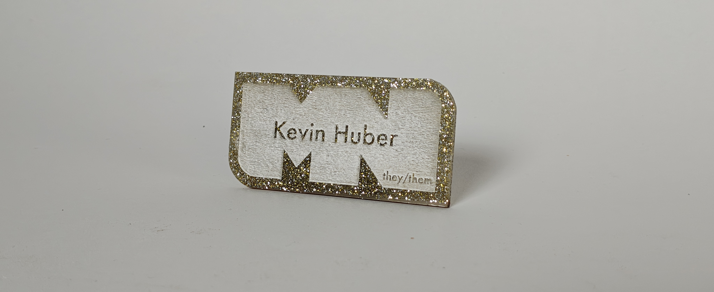
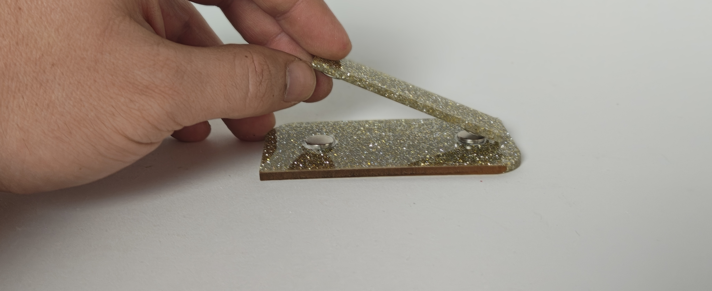
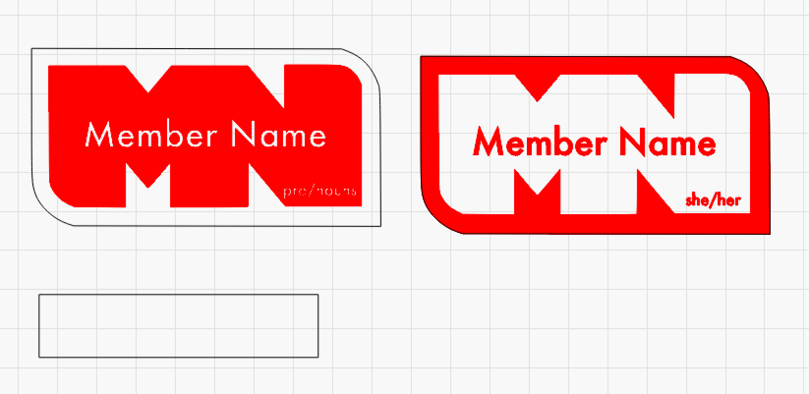

# How to cut a nametag
1. Open `nametags.lbrn2` 
2. Choose whether you would like the MN carved or outlined between the two designs
3. Replace `Member Name` with your name, and `pro/nouns` with your pronouns. 
4. Cut out both the tag and the magnet holder
5. Glue two magnets to the back of the holder, and the back of the tag. Make sure they are facing the correct direction.
6. Identify yourself! You are welcome to wear this around the space or when representing Make at an event. 